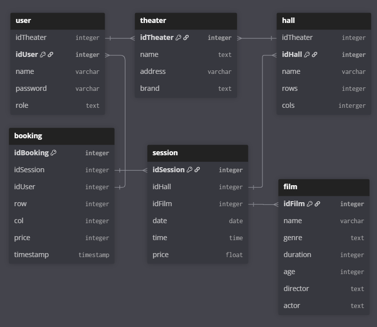

# Theater Ticketing System

A command-line based theater ticketing system built in Python, using CSV files for data persistence. This system allows users to manage theaters, halls, films, sessions, bookings, and provides different access levels for guests, receptionists, and managers.

## Background

Each theater shows the same film at different times and in different locations. Because of this, guests often struggle to find a suitable cinema and showtime for the movies they want to watch. A unified ticketing system can simplify this process by helping users search across theaters, compare showtimes, and book seats easily.

## Stakeholders

- Theater Receptionist: Checks guests’ tickets at the entrance and verifies their bookings.

- Theater Manager: Reviews guest data, analyzes sales, manages film schedules, and oversees theater performance.

- Guests: Search for theaters and films, view showtimes, book seats, make payments, and rate or comment on films they watched.

- Development Team (my team): Will later implement features such as a Recommendation System to suggest suitable films based on guest preferences and history.

## Future Improvements

- **UI/UX Design:** Build a more interactive and intuitive interface so users can search and book tickets smoothly instead of using only a command-line or basic form interface.

- **Recommendation System:** Recommend films to guests based on their previous ratings, genre preferences, booking history, or trending movies, improving both user convenience and theater revenue.

## Features

- **User Management**: Login and signup with role-based access (guest, receptionist, manager).
- **Film Management**: Add, list, sort, and filter films by various attributes.
- **Session Management**: View sessions for films, filtered by theater for staff.
- **Seat Booking**: Interactive seat selection with visual seat maps.
- **Analytics**: Occupancy rate calculation for sessions.
- **Data Persistence**: All data stored in CSV files in the `data/` directory.

## Installation

1. Ensure Python 3.x is installed.
2. Clone or download the project files.
3. Run `create_data.py` to initialize sample data:
```
python create_data.py
```
This creates CSV files in the `data/` directory with sample theaters, halls, films, sessions, users, and bookings.

## Usage

Run the main application:
```
python runner.py
```

### User Roles

- **Guest**: Can list films, view sessions, and book seats.
- **Receptionist**: Can view sessions and bookings for their assigned theater, and show seat maps.
- **Manager**: Can view sessions with occupancy, manage bookings, add new films and halls, and list films with sorting/filtering.

### Sample Users

- Manager: username `manager1`, password `m123` (assigned to T000001)
- Receptionist: username `reception1`, password `r123` (assigned to T000001)
- Guest: username `guest1`, password `g123`

## File Structure

- `runner.py`: Main application script with CLI menus.
- `utils.py`: Utility functions for ID generation, CSV handling, datetime parsing, and directory management.
- `constructor.py`: Data model classes (Theater, Hall, Film, Session, User, Booking).
- `services.py`: Business logic for seat maps, booking, and occupancy calculations.
- `repository.py`: Data access layer for loading and saving records to/from CSV files.
- `create_data.py`: Script to bootstrap sample data into CSV files.
- `data/`: Directory containing CSV files for data persistence.

## Database structure



- **theater.csv**: idTheater, name, address, brand
- **hall.csv**: idHall, idTheater, name, rows, cols
- **film.csv**: idFilm, name, genre, duration, age, director, actor
- **session.csv**: idSession, idHall, idFilm, date, time, price
- **user.csv**: idUser, idTheater, name, password, role
- **booking.csv**: idBooking, idSession, idUser, row, col, price, timestamp

## Dependencies

- Standard Python libraries: `os`, `datetime`, `typing`
- No external dependencies required.

## Notes

- IDs are auto-generated with prefixes (T for Theater, H for Hall, etc.) and zero-padded to 6 digits.
- Dates are in YYYY-MM-DD format, times in HH:MM.
- Seat maps display rows and columns, with [X] for booked seats and [ ] for available.
- Bookings include timestamps and are immutable once created.
